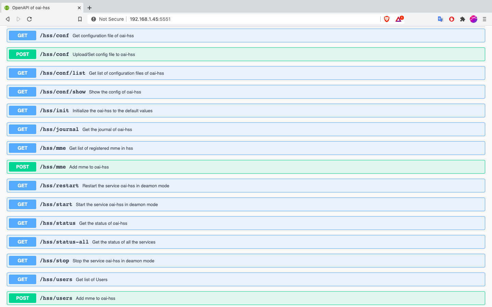

## OpenAPI of oai snaps v2
You can access to the OpenAPI of the oai snaps v2 as follows (IP_addrr is a valide of ip address of the machine on which you are running this docker-compose):
- oai-hss http://IP_addrr:5551/
- oai-mme http://IP_addrr:5552/
- oai-spgwc http://IP_addrr:5553/
- oai-spgwu http://IP_addrr:5554/

We also provide API manager for the OpenAPI. Note that this API need to be enabled from the OpenAPI. 
- oai-hss http://IP_addrr:6661/
- oai-mme http://IP_addrr:6662/
- oai-spgwc http://IP_addrr:6663/
- oai-spgwu http://IP_addrr:6664/

Here are the screenshot of OpenAPI of oai-hss as an example

